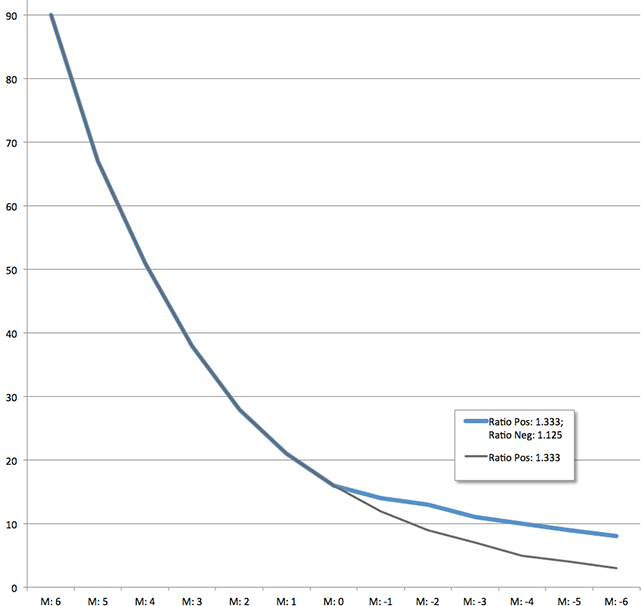
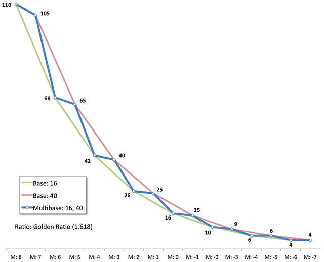

# Sassy Modular Scale

My fork of [Scott Kellum's](http://www.scottkellum.com/) ([@scottkellum](http://twitter.com/scottkellum)) and Team-Sass' [Modular Scale](https://github.com/Team-Sass/modular-scale) that adds the option for a separate scale for negative multiples.

I really like the idea of a modular scale but it is always difficult to pick a ratio that works well for larger sizes (positive multiples) _**and**_ smaller sizes (negative multiples). If the positive multiples progress at a pleasing rate—the negative multiples get too small too quickly to be of much use. And if a ratio works for negative multiples, it seems the sizes of positive multiples increased too slowly.

To correct this, I have modified the Modular Scale code so that a different ratio for negative multiples can now be defined (`$ratio-negative`). If set to `false` (the default), the standard ratio (`$ratio`) is used for both positive and negative values.

Let's look at the following table comparing the values for the perfect fourth scale (1.333) for all multiples versus the perfect fourth scale for positive multiples and the major second scale (1.125) for negative multiples.

<table cellspacing="0">
	<tr>
		<th>Multiple</th>
		<th>Ratio All: 1.333</th>
		<th>Ratio Pos: 1.333 Ratio Neg: 1.125</th>
	</tr>
	<tr>
		<th align="center">6</th>
		<td align="center">90</td>
		<td align="center">90</td>
	</tr>
	<tr>
		<th align="center">5</th>
		<td align="center">67</td>
		<td align="center">67</td>
	</tr>
	<tr>
		<th align="center">4</th>
		<td align="center">51</td>
		<td align="center">51</td>
	</tr>
	<tr>
		<th align="center">3</th>
		<td align="center">38</td>
		<td align="center">38</td>
	</tr>
	<tr>
		<th align="center">2</th>
		<td align="center">28</td>
		<td align="center">28</td>
	</tr>
	<tr>
		<th align="center">1</th>
		<td align="center">21</td>
		<td align="center">21</td>
	</tr>
	<tr>
		<th align="center">0</th>
		<td align="center">16</td>
		<td align="center">16</td>
	</tr>
	<tr>
		<th align="center">-1</th>
		<td align="center">12</td>
		<td align="center">14</td>
	</tr>
	<tr>
		<th align="center">-2</th>
		<td align="center">9</td>
		<td align="center">13</td>
	</tr>
	<tr>
		<th align="center">-3</th>
		<td align="center">7</td>
		<td align="center">11</td>
	</tr>
	<tr>
		<th align="center">-4</th>
		<td align="center">5</td>
		<td align="center">10</td>
	</tr>
	<tr>
		<th align="center">-5</th>
		<td align="center">4</td>
		<td align="center">9</td>
	</tr>
	<tr>
		<th align="center">-6</th>
		<td align="center">3</td>
		<td align="center">8</td>
	</tr>
</table>

The positive multiples for the 1.333 ratio progress nicely—but the negative multiples get too small much too quick. The first step goes from 16 to 12—a very big jump. The second step is 9. And at only the third step the value is a *very* small 7.

Now compare this to the column where the ratio for negative multiples is 1.125. You still get the nice 1.333 ratio progression for positive multiples, and the negative multiples get smaller at a much more usable rate. The following chart illustrates this.

###Multibases and Multiratios Removed
I have also removed the multibase and multiratio features because they made things much more complicated programmatically and their use, from a design standpoint, doesn't make much sense to me. Two scales laid on top of each other usually creates a stair-step effect and, IMO, goes against the idea of a smooth scale. The chart below illustrates this stair-step effect as the values for the multibase scale jump between the values of each base's scale. 

I understand that there may be a need for multiple scales on a page—but I think they should be interacted with independent of each other.

###Removed Gem Files
To avoid issues with the Modular Scale gem, I have "de-Gemified" the code so it is now a self-contained .scss file with no dependencies.

## License
Copyright (c) 2011 [Scott Kellum](http://www.scottkellum.com/) ([@scottkellum](http://twitter.com/scottkellum)), [Adam Stacoviak](http://adamstacoviak.com/) ([@adamstac](http://twitter.com/adamstac)) and [Mason Wendell](http://thecodingdesigner.com/) ([@codingdesigner](http://twitter.com/codingdesigner))

Permission is hereby granted, free of charge, to any person obtaining a copy of this software and associated documentation files (the "Software"), to deal in the Software without restriction, including without limitation the rights to use, copy, modify, merge, publish, distribute, sublicense, and/or sell copies of the Software, and to permit persons to whom the Software is furnished to do so, subject to the following conditions:

The above copyright notice and this permission notice shall be included in all copies or substantial portions of the Software.

THE SOFTWARE IS PROVIDED "AS IS", WITHOUT WARRANTY OF ANY KIND, EXPRESS OR IMPLIED, INCLUDING BUT NOT LIMITED TO THE WARRANTIES OF MERCHANTABILITY, FITNESS FOR A PARTICULAR PURPOSE AND NONINFRINGEMENT. IN NO EVENT SHALL THE AUTHORS OR COPYRIGHT HOLDERS BE LIABLE FOR ANY CLAIM, DAMAGES OR OTHER LIABILITY, WHETHER IN AN ACTION OF CONTRACT, TORT OR OTHERWISE, ARISING FROM, OUT OF OR IN CONNECTION WITH THE SOFTWARE OR THE USE OR OTHER DEALINGS IN THE SOFTWARE.
